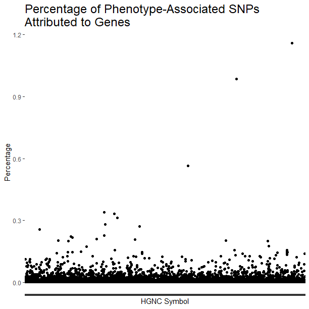
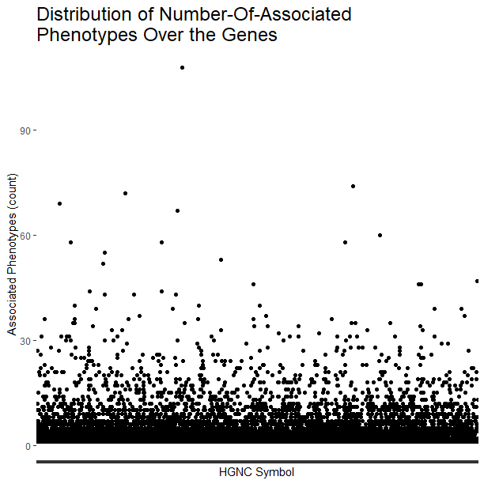
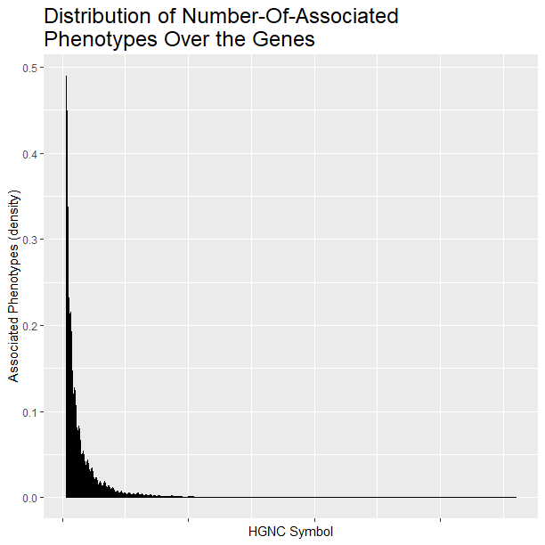
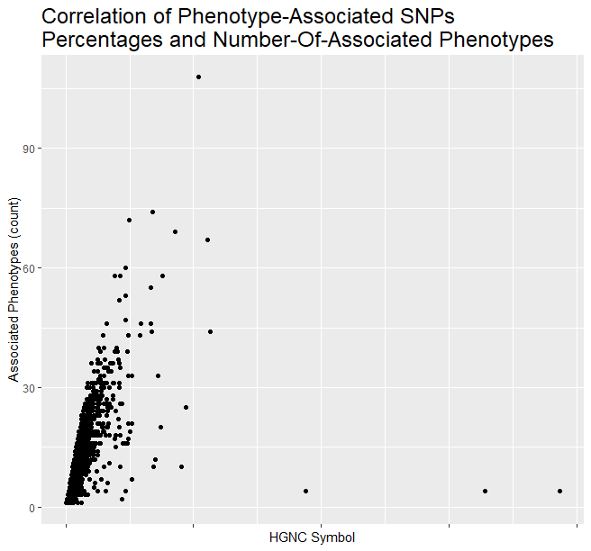

# `BCB420.2019.GWAS`

#### (**GWAS data annotatation of human genes**)


###### [Sapir  Labes](https://orcid.org/0000-0002-9478-5974), Department of Molecular Biology, Immunology and Cancer Research, The Hebrew University of Jerusalem, Israel. &lt;sapir.labes@mail.huji.ac.il&gt;
###### The template for this README file, as well as most written under "about this package", was quoted and paraphrased from the author Boris Steipe, [the link](https://github.com/hyginn/BCB420.2019.STRING)

----

**If any of this information is ambiguous, inaccurate, outdated, or incomplete, please check the [most recent version](https://github.com/sapirl/BCB420.2019.GWAS) of the package on GitHub and [file an issue](https://github.com/sapirl/BCB420.2019.GWAS/issues).**

----

### 1 About this package:

----

This package describes the workflow to download SNPs data and their association with human diseases from [the GWAS database](https://www.ebi.ac.uk/gwas/docs/file-downloads), how to map the IDs to [HGNC](https://www.genenames.org/) symbols, how to annotate the example gene set, and provides examples of computing database statistics.
<br>

The package serves dual duty, as an RStudio project, as well as an R package that can be installed. Package checks pass without errors, warnings, or notes.
<br>

This package supports R users, researchers and developers that want to map or index the GWAS data to  HGNC symbols.
<br>
<br>

**In this project**
<br>

```
 --BCB420.2019.GWAS/
   |__.gitignore
   |__.Rbuildignore
   |__BCB420.2019.GWAS.Rproj
   |__BCB420_2019_GWAS.html
   |__BCB420_2019_GWAS.Rmd
   |__DESCRIPTION
   |__dev/
      |__functionTemplate.R
      |__rptTwee.R
      |__toBrowser.R
   |__inst/
      |__extdata/
         |__exmpAnnotated.yaml
         |__gwas2sym.RData
         |__test_lseq.dat
      |__img/
         |__correlation.png
         |__Density_phenotypes.png
         |__percentage.png
         |__Scatter_phenotypes.png
      |__scripts/
         |__scriptTemplate.R
   |__LICENSE
   |__man/
      |__lseq.Rd
   |__NAMESPACE
   |__R/
      |__lseq.R
      |__zzz.R
   |__README.md         #This file
   |__tests/
      |__testthat.R
      |__testthat/
         |__helper-functions.R
         |__test_lseq.R
         
```


### 2. GWAS Data

----

As quoted and paraphrased from GWAS's [website](https://www.ebi.ac.uk/gwas/docs/about):
The Genome Wide Association Studies Catalog (denoted as GWAS) was founded by the [NHGRI](https://www.genome.gov/) in 2008. The GWAS Catalog provides a consistent, searchable, visualisable and freely available database of published SNP-trait associations (i.e., the association between common Single Nucleotide Variants and complex disease).
Within the Catalog, all eligible GWA studies are identified by literature search and assessed by the GWAS Catalog's curators, who then extract the reported trait, significant SNP-trait associations, and sample metadata.
The database curates eligible studies within 1-2 months of publication, and the data is released on a weekly cycle.
Since 2010, delivery and development of the Catalog has been a collaborative project between the EMBL-EBI and NHGRI. The Catalog website and infrastructure is now hosted by EMBL-EBI.

There are several versions available to download, as described [here](https://www.ebi.ac.uk/gwas/docs/fileheaders).
This package uses the 1.0.2 version, which is the most updated one, that also includes the ontology for the mapped trait, the study accession ID and the genotyping technology data
<br><br><br>

#### **2.1 Data Semantics**  

Quoted and paraphrased from [GWAS websit](https://www.ebi.ac.uk/gwas/docs/file-downloads)
<br>
<br>

##### *File headers for catalog version 1.0.2*

- **DATE ADDED TO CATALOG**: Date a study is published in the catalog
- **PUBMEDID**: PubMed identification number
- **FIRST AUTHOR**: Last name and initials of first author
- **DATE**: Publication date (online (epub) date if available)
- **JOURNAL**: Abbreviated journal name
- **LINK**: PubMed URL
- **STUDY**: Title of paper
- **DISEASE/TRAIT**: Disease or trait examined in study
- **INITIAL SAMPLE DESCRIPTION**: Sample size and ancestry description for stage 1 of GWAS (summing across multiple Stage 1 populations, if applicable)
- **REPLICATION SAMPLE DESCRIPTION**: Sample size and ancestry description for subsequent replication(s) (summing across multiple populations, if applicable)
- **REGION**: Cytogenetic region associated with rs number
- **CHR_ID**: Chromosome number associated with rs number
- **CHR_POS**: Chromosomal position associated with rs number
- **REPORTED GENE(S)**: Gene(s) reported by author, HGNC symbols
- **MAPPED GENE(S)**: Gene(s) mapped to the strongest SNP, HGNC symbols. If the SNP is located within a gene, that gene is listed. If the SNP is intergenic, the upstream and downstream genes are listed, separated by a hyphen. Genes that are not charachterized and has no gene names, are listed as "LOC" and identifier number (according to [NCBI book](https://www.ncbi.nlm.nih.gov/books/NBK3840/#genefaq.Conventions).
- **UPSTREAM_GENE_ID**: Entrez Gene ID for nearest upstream gene to rs number, if not within gene
- **DOWNSTREAM_GENE_ID**: Entrez Gene ID for nearest downstream gene to rs number, if not within gene
- **SNP_GENE_IDS**: Entrez Gene ID, if rs number within gene; multiple genes denotes overlapping transcripts
- **UPSTREAM_GENE_DISTANCE**: distance in kb for nearest upstream gene to rs number, if not within gene
- **DOWNSTREAM_GENE_DISTANCE**: distance in kb for nearest downstream gene to rs number, if not within gene
- **STRONGEST SNP-RISK ALLELE**: SNP(s) most strongly associated with trait + risk allele (? for unknown risk allele). May also refer to a haplotype.
- **SNPS**: Strongest SNP; if a haplotype it may include more than one rs number (multiple SNPs comprising the haplotype)
- **MERGED**: denotes whether the SNP has been merged into a subsequent rs record (0 = no; 1 = yes;)
- **SNP_ID_CURRENT**: current rs number (will differ from strongest SNP when merged = 1)
- **CONTEXT**: SNP functional class
- **INTERGENIC**: denotes whether SNP is in intergenic region (0 = no; 1 = yes)
- **RISK ALLELE FREQUENCY**: Reported risk/effect allele frequency associated with strongest SNP in controls (if not available among all controls, among the control group with the largest sample size). If the associated locus is a haplotype the haplotype frequency will be extracted.
- **P-VALUE**: Reported p-value for strongest SNP risk allele (linked to dbGaP Association Browser). Note that p-values are rounded to 1 significant digit (for example, a published p-value of 4.8 x 10-7 is rounded to 5 x 10-7).
- **PVALUE_MLOG**: -log(p-value)
- **P-VALUE (TEXT)**: Information describing context of p-value (e.g. females, smokers).
- **OR or BETA**: Reported odds ratio or beta-coefficient associated with strongest SNP risk allele. Note that if an OR <1 is reported this is inverted, along with the reported allele, so that all ORs included in the Catalog are >1. Appropriate unit and increase/decrease are included for beta coefficients.
- **95% CI (TEXT)**: Reported 95% confidence interval associated with strongest SNP risk allele, along with unit in the case of beta-coefficients. If 95% CIs are not published, we estimate these using the standard error, where available.
- **PLATFORM (SNPS PASSING QC)**: Genotyping platform manufacturer used in Stage 1; also includes notation of pooled DNA study design or imputation of SNPs, where applicable
- **CNV**: Study of copy number variation (yes/no)
- **MAPPED_TRAIT**: Mapped Experimental Factor Ontology trait for this study
- **MAPPED_TRAIT_URI**: URI of the EFO trait
- **STUDY ACCESSION**: Accession ID allocated to a GWAS Catalog study
- **GENOTYPING_TECHNOLOGY**: Genotyping technology/ies used in this study, with additional array information (ex. Immunochip or Exome array) in brackets.

<br>
Full Description of Abbreviations used in the [Catalog](https://www.ebi.ac.uk/gwas/docs/abbreviations)
<br><br><br>


#### **In summary**
 - Association evidence in GWAS is determined according to the SNPs (or haplotypes) that are most strongly associated with trait + risk/effect allele, according to their reported P value. 
 - For each association, odds ratio (OR) or beta-coefficient (BETA) associated with strongest SNP risk allele are reported, as well as the risk allele frequency in controls (if not available among all controls, among the control group with the largest sample size)
 - Within the GWAS dataset, the column "MAPPED_GENE" provides the HGNC symbols of which the SNPs are mapped to. Some SNPs do not correspond to genes (i.e., intergenic) and some correspond to genes that were not yet characterized with HGNC symbols (denoted as "LOC" + identifier). This means that the main challenge for aligning between GWAS database and the appropriate HGNC symbols is to filter out the redundant SNP data, i.e., all SNPs that are not mapped to a gene that has a defined HGNC symbol. Another challenge would be to organize the filtered GWAS database to be comfortably accessible according to a desired HGNC symbol.
<br>
<br>
<br>

### **3 Data download and cleanup**

----


#### **3.1 Preparations: packages**

 - To begin, we need to make sure the required packages are installed.
 - The following code was written by the author Boris Steipe and published at [GitHub](https://github.com/hyginn/R_Exercise-BasicSetup/blob/master/plottingIntro.R)  
<br>
<br>

According to [cran](https://cran.r-project.org/web/packages/data.table/index.html), **data.table** package provides functions to fast aggregate large data (e.g. 100GB in RAM), fast ordered joins, fast add/modify/delete of columns by group using no copies at all, list columns, friendly and fast character-separated-value read/write.

```R
if (!require(data.table, quietly=TRUE)){
  install.packages("data.table")
}
```
<br>

According to [cran](https://cran.r-project.org/web/packages/tidyr/index.html), **tidyr** package is designed specifically for data tidying (not general reshaping or aggregating) and works well with 'dplyr' data pipelines.

```R
if (!require(tidyr, quietly=TRUE)) {
  install.packages("tidyr")
}
```
<br>

According to [cran](https://cran.r-project.org/web/packages/stringr/vignettes/stringr.html), **stringr** package is used for character manipulations: these functions allow you to manipulate individual characters within the strings in character vectors. For instance: Whitespace tools to add, remove, and manipulate whitespace; Locale sensitive operations whose operations will vary from locale to locale; Pattern matching functions. 

```R
if (!require(stringr, quietly=TRUE)) {
  install.packages("stringr")
}
```
<br>

According to [cran](https://cran.r-project.org/web/packages/ggplot2/index.html), **ggplot2** package is a system for 'declaratively' creating graphics, based on "The Grammar of Graphics". You provide the data, tell 'ggplot2' how to map variables to aesthetics, what graphical primitives to use, and it takes care of the details.

```R
if (!require(ggplot2, quietly=TRUE)) {
  install.packages("ggplot2")
  library(ggplot2)
}
```
<br>

The code and the descrtiption were copied from [Boris Steipe's description](https://github.com/hyginn/BCB420.2019.STRING):  
BiomaRt is a Bioconductor package that implements the RESTful API of biomart, the annotation framwork for model organism genomes at the EBI. It is a Bioconductor package, and as such it needs to be loaded via the BiocManager,  
```R
if (! requireNamespace("BiocManager", quietly = TRUE)) {
  install.packages("BiocManager")
}
if (! requireNamespace("biomaRt", quietly = TRUE)) {
  BiocManager::install("biomaRt")
}
```
<br>

According to [cran](https://cran.r-project.org/web/packages/HGNChelper/index.html), **HGNChelper** package contains functions for identifying and correcting HGNC human gene symbols and MGI mouse gene symbols which have been converted to date format by Excel, withdrawn, or aliased. Also contains functions for reversibly converting between HGNC symbols and valid R names.

```R
if (!require(HGNChelper, quietly=TRUE)) {
  install.packages("HGNChelper")
}
```
<br>

According to [cran](https://cran.r-project.org/web/packages/rlist/index.html), **rlist** package provides a set of functions for data manipulation with list objects, including mapping, filtering, grouping, sorting, updating, searching, and other useful functions. Most functions are designed to be pipeline friendly so that data processing with lists can be chained.

```R
if (!require(rlist, quietly=TRUE)) {
  install.packages("rlist")
}
```

<br><br>
 
#### **3.2 Downloading the data**

**Notes**:


 - The data is over 50 megabytes size.
 - The API links to the most recent version release of the GWAS database. This database **updates** weekly, with the most recent update available at the same link.
 - A new **version** (not an update) may be released and published in a different URL. Caution needs to be taken: before using the following API, the user needs to check [GWAS downloads webpage](https://www.ebi.ac.uk/gwas/docs/file-downloads) for new releases and updates, and change the current used URL accordingly.
 - The code "as.data.frame(data.table::fread())" was written by the author Tarun Bhavnani and published at [Stacksoverflow](https://stackoverflow.com/questions/33322248/how-to-import-tsv-file-in-r), as a way to download tsv file according to an API.

<br>

Downloading the data according to the API provided in the GWAS website
```R
GWASraw <- as.data.frame(data.table::fread("https://www.ebi.ac.uk/gwas/api/search/downloads/full"))
```
<br>
<br>

What is the data's structure?
```R
str(GWASraw)
#'data.frame':	104767 obs. of  34 variables:
# $ DATE ADDED TO CATALOG     : chr  "2015-12-18" "2015-12-18" "2015-12-18" "2015-12-18" ...
# $ PUBMEDID                  : int  25574825 25574825 25574825 25574825 25574825 25574825 25574825 25574825 25574825 25574825 ...
# $ FIRST AUTHOR              : chr  "Baurecht H" "Baurecht H" "Baurecht H" "Baurecht H" ...
# $ DATE                      : chr  "2015-01-08" "2015-01-08" "2015-01-08" "2015-01-08" ...
# $ JOURNAL                   : chr  "Am J Hum Genet" "Am J Hum Genet" "Am J Hum Genet" "Am J Hum Genet" ...
# $ LINK                      : chr  "www.ncbi.nlm.nih.gov/pubmed/25574825" "www.ncbi.nlm.nih.gov/pubmed/25574825" "www.ncbi.nlm.nih.gov/pubmed/25574825" "www.ncbi.nlm.nih.gov/pubmed/25574825" ...
# $ STUDY                     : chr  "Genome-wide comparative analysis of atopic dermatitis and psoriasis gives insight into opposing genetic mechanisms." "Genome-wide comparative analysis of atopic dermatitis and psoriasis gives insight into opposing genetic mechanisms." "Genome-wide comparative analysis of atopic dermatitis and psoriasis gives insight into opposing genetic mechanisms." "Genome-wide comparative analysis of atopic dermatitis and psoriasis gives insight into opposing genetic mechanisms." ...
# $ DISEASE/TRAIT             : chr  "Inflammatory skin disease" "Inflammatory skin disease" "Inflammatory skin disease" "Inflammatory skin disease" ...
# $ INITIAL SAMPLE SIZE       : chr  "2,079 European ancestry atopic dermatitis cases, 4,212 European ancestry psoriasis cases, 11,899 European ancestry controls" "2,079 European ancestry atopic dermatitis cases, 4,212 European ancestry psoriasis cases, 11,899 European ancestry controls" "2,079 European ancestry atopic dermatitis cases, 4,212 European ancestry psoriasis cases, 11,899 European ancestry controls" "2,079 European ancestry atopic dermatitis cases, 4,212 European ancestry psoriasis cases, 11,899 European ancestry controls" ...
# $ REPLICATION SAMPLE SIZE   : chr  NA NA NA NA ...
# $ REGION                    : chr  "3q26.32" "2p25.3" "17q25.3" "10q26.3" ...
# $ CHR_ID                    : chr  "3" "2" "17" "10" ...
# $ CHR_POS                   : chr  "177009491" "2221629" "78284479" "129683009" ...
# $ REPORTED GENE(S)          : chr  "TBL1XR1" "MYT1L" "RP11-219G17.4" "MGMT" ...
# $ MAPPED_GENE               : chr  "LINC01209 - MTND5P15" "MYT1L" "LOC100996291 - LOC105371912" "MGMT" ...
# $ UPSTREAM_GENE_ID          : int  101928684 NA 100996291 NA 127623 106481095 353143 NA NA NA ...
# $ DOWNSTREAM_GENE_ID        : int  100873259 NA 105371912 NA 441932 400957 353142 NA NA NA ...
# $ SNP_GENE_IDS              : chr  "" "23040" "" "4255" ...
# $ UPSTREAM_GENE_DISTANCE    : int  192490 NA 5987 NA 38128 13503 5707 NA NA NA ...
# $ DOWNSTREAM_GENE_DISTANCE  : int  928 NA 57605 NA 958 2328 3029 NA NA NA ...
# $ STRONGEST SNP-RISK ALLELE : chr  "rs1384974-?" "rs6548123-?" "rs9302874-?" "rs80312298-?" ...
# $ SNPS                      : chr  "rs1384974" "rs6548123" "rs9302874" "rs80312298" ...
# $ MERGED                    : int  0 0 0 0 0 0 0 0 0 0 ...
# $ SNP_ID_CURRENT            : chr  "1384974" "6548123" "9302874" "80312298" ...
# $ CONTEXT                   : chr  "intergenic_variant" "intron_variant" "regulatory_region_variant" "intron_variant" ...
# $ INTERGENIC                : int  1 0 1 0 1 1 1 0 0 0 ...
# $ RISK ALLELE FREQUENCY     : chr  "NR" "NR" "NR" "NR" ...
# $ P-VALUE                   : chr  "4E-8" "6E-8" "2E-7" "6E-7" ...
# $ PVALUE_MLOG               : num  7.4 7.22 6.7 6.22 5.22 ...
# $ P-VALUE (TEXT)            : chr  "(Opposed)" "(Opposed)" "(Opposed)" "(Opposed)" ...
# $ OR or BETA                : num  NA NA NA NA NA 1.2 1.22 1.27 1.27 1.29 ...
# $ 95% CI (TEXT)             : chr  "" "" "" "" ...
# $ PLATFORM [SNPS PASSING QC]: chr  "Affymetrix, Illumina [~ 5200000]" "Affymetrix, Illumina [~ 5200000]" "Affymetrix, Illumina [~ 5200000]" "Affymetrix, Illumina [~ 5200000]" ...
# $ CNV                       : chr  "N" "N" "N" "N" ...
```
<br>

#### **3.3 choosing the relevant columns**
As shown above, the raw GWAS database has 34 columns.  
Most columns hold data that does not concern to SNPs and their associated diseases and risks. The full semantics is described in chapter 2 of this README file.  
<br>
Leaving too many columns might cause confusion when trying to extract infrormation from the database, and even worse - the database would be too large to analyse due too increased size.  
<br>
Including columns that contain the associated disease, the mapped HGNC symbols, the SNP's identifiers ("SNPS", "MERGED", "SNP_ID_CURRENT"), the risk allele, the P value and risk ratio of the association, the information whether the SNP was mapped to a gene or is intergenic:
```R
GWASprocessed <- GWASraw[,c("DISEASE/TRAIT", #of which the SNP has association to
                            "MAPPED_GENE", #The HGNC symbol of the gene that the SNP is mapped to
                            "STRONGEST SNP-RISK ALLELE", 
                            "SNPS", 
                            "MERGED", 
                            "SNP_ID_CURRENT",
                            "CONTEXT", 
                            "INTERGENIC", 
                            "RISK ALLELE FREQUENCY", 
                            "P-VALUE", 
                            "PVALUE_MLOG", 
                            "OR or BETA")] 
```
<br>
<br>

### **4 Filtering out unnecessary observations**

----

As explained earlier, there are non informative observations in the data that we need to filter out:
 - SNPs that were not mapped to HGNC symbols: intergenic SNPs, genes that were not characterized yet ("LOC"), missing data ("", NA).
<br>
<br>

#### **4.1 Dealing with intergenic SNPs**

The "intergenic" column provides the information of whether the SNP is intergenic or within a gene.  
Our goal is to map SNPs to their corresponding HGNC symbols, which exists for genes and not for intergenic regions.  
When observing the available observations along the "intergenic" column, we can see that besides 0 and 1, some rows retrieve NA:
```R
base::unique(GWASprocessed$INTERGENIC)
#[1]  1  0 NA

#How many NAs
base::sum(base::is.na(GWASprocessed$INTERGENIC))
#[1] 437
```
<br>
We want to filter out all intergenic SNPs.  
This means that filtering out SNPs that are intergenic can't be done by an expression such as `GWASprocessed <- GWASprocessed[GWASprocessed$INTERGENIC==0, ]`, which will retrieve rows of NAs whenever the "Intergenic" is NA.  
Also, we should observe the data that retrieves NA, for the sake of deciding which data to leave in the database and which should be filtered out.
<br>
<br>

##### **4.1.1 Dealing With NAs**
Observing the data that has NA in the "INTERGENIC" column
```R
NAintronic <- GWASprocessed[base::which(base::is.na(GWASprocessed$INTERGENIC)),]

#Observing the structure - there are 437 observations in total
utils::str(NAintronic)
# 'data.frame':	437 obs. of  13 variables:
#  $ DISEASE/TRAIT            : chr  "Major depressive disorder" "Major depressive disorder" "Ankylosing spondylitis (SNP x SNP interaction)" "Ankylosing spondylitis (SNP x SNP interaction)" ...
#  $ MAPPED_GENE              : chr  "OSTM1-AS1; OSTM1-AS1; RPL3P7 - LOC105377929; OSTM1 - OSTM1-AS1; LOC105377929; RPL3P7 - LOC105377929; LOC1053779"| __truncated__ "LOC105376375 - AKR1E2; RNU6-163P - LINC00704; LOC107984197; LOC105376375; LOC105376375 - AKR1E2; LOC105376374; "| __truncated__ "ERAP1 x RNU6-283P - FGFR3P1" "LOC105379092, ERAP1 x RNU6-283P - FGFR3P1" ...
#  $ STRONGEST SNP-RISK ALLELE: chr  "rs9486815-G; rs4245535-G; rs17069173-A; rs9374021-G; rs9374007-A; rs9386694-A; rs9374002-G; rs218289-A; rs10643"| __truncated__ "rs7893291-C; rs10904299-A; rs11252672-G; rs1901632-A; rs11252715-G; rs11818567-A; rs11252622-G; rs7906409-A; rs"| __truncated__ "rs30187-? x rs116488202-?" "rs10045403-? x rs116488202-?" ...
#  $ SNPS                     : chr  "rs9486815; rs4245535; rs17069173; rs9374021; rs9374007; rs9386694; rs9374002; rs218289; rs1064346; rs9374013; r"| __truncated__ "rs7893291; rs10904299; rs11252672; rs1901632; rs11252715; rs11818567; rs11252622; rs7906409; rs416990; rs109043"| __truncated__ "rs30187 x rs116488202" "rs10045403 x rs116488202" ...
#  $ MERGED                   : int  1 0 0 0 0 0 0 0 0 0 ...
#  $ SNP_ID_CURRENT           : chr  "" "" "" "" ...
#  $ CONTEXT                  : chr  "intron_variant; intron_variant; regulatory_region_variant; intron_variant; intergenic_variant; intergenic_varia"| __truncated__ "intergenic_variant; intergenic_variant; intergenic_variant; regulatory_region_variant; intergenic_variant; regu"| __truncated__ "missense_variant x intergenic_variant" "intergenic_variant x intergenic_variant" ...
#  $ INTERGENIC               : int  NA NA NA NA NA NA NA NA NA NA ...
#  $ RISK ALLELE FREQUENCY    : chr  "NR" "NR" "NR" "NR" ...
#  $ P-VALUE                  : chr  "3E-7" "8E-8" "3E-11" "9E-6" ...
#  $ PVALUE_MLOG              : num  6.52 7.1 10.52 5.05 9.1 ...
#  $ OR or BETA               : num  1.26 1.67 0.39 0.282 NA ...


#viewing the data
View(NAintronic)
```
<br>
<br>

**When observing the data, several kinds of associations are revealed**  

**(1)** SNP X SNP interactions: more complex kind of association between a disease and SNPs. Most SNP x SNP interactions contain at least one SNP that does not have an equivalent HGNC symbol, either because the SNP is intergenic or because it is mapped to a gene that wasn't characterized. In total, if we remove all rows of SNP interaction data, we have 178 out of 437 observations remaining. 
 
```R
#A data frame without SNP x SNP interactions data
NOsnpX <- NAintronic[!base::grepl(x = NAintronic$`DISEASE/TRAIT`, pattern = "SNP"), ]

#Observing the structure
utils::str(NOsnpX)
# 'data.frame':	178 obs. of  13 variables:
#  $ DISEASE/TRAIT            : chr  "Major depressive disorder" "Major depressive disorder" "Amyotrophic lateral sclerosis" "Amyotrophic lateral sclerosis" ...
#  $ MAPPED_GENE              : chr  "OSTM1-AS1; OSTM1-AS1; RPL3P7 - LOC105377929; OSTM1 - OSTM1-AS1; LOC105377929; RPL3P7 - LOC105377929; LOC1053779"| __truncated__ "LOC105376375 - AKR1E2; RNU6-163P - LINC00704; LOC107984197; LOC105376375; LOC105376375 - AKR1E2; LOC105376374; "| __truncated__ "C9orf72; LOC107987057" "C9orf72; LOC107987057" ...
#  $ STRONGEST SNP-RISK ALLELE: chr  "rs9486815-G; rs4245535-G; rs17069173-A; rs9374021-G; rs9374007-A; rs9386694-A; rs9374002-G; rs218289-A; rs10643"| __truncated__ "rs7893291-C; rs10904299-A; rs11252672-G; rs1901632-A; rs11252715-G; rs11818567-A; rs11252622-G; rs7906409-A; rs"| __truncated__ "rs10122902-G; rs3849942-A" "rs10122902-G; rs3849942-G" ...
#  $ SNPS                     : chr  "rs9486815; rs4245535; rs17069173; rs9374021; rs9374007; rs9386694; rs9374002; rs218289; rs1064346; rs9374013; r"| __truncated__ "rs7893291; rs10904299; rs11252672; rs1901632; rs11252715; rs11818567; rs11252622; rs7906409; rs416990; rs109043"| __truncated__ "rs10122902; rs3849942" "rs10122902; rs3849942" ...
#  $ MERGED                   : int  1 0 0 0 0 0 0 0 0 0 ...
#  $ SNP_ID_CURRENT           : chr  "" "" "" "" ...
#  $ CONTEXT                  : chr  "intron_variant; intron_variant; regulatory_region_variant; intron_variant; intergenic_variant; intergenic_varia"| __truncated__ "intergenic_variant; intergenic_variant; intergenic_variant; regulatory_region_variant; intergenic_variant; regu"| __truncated__ "synonymous_variant; non_coding_transcript_exon_variant" "synonymous_variant; non_coding_transcript_exon_variant" ...
#  $ INTERGENIC               : int  NA NA NA NA NA NA NA NA NA NA ...
#  $ RISK ALLELE FREQUENCY    : chr  "NR" "NR" "0.23" "0.57" ...
#  $ P-VALUE                  : chr  "3E-7" "8E-8" "8E-10" "5E-11" ...
#  $ PVALUE_MLOG              : num  6.52 7.1 9.1 10.3 8 ...
#  $ OR or BETA               : num  1.26 1.67 NA NA 1.38 2.56 1.76 2.56 1.95 1.76 ...
```
<br>
<br>

**(2)** SNP X mitochondrial interactions: this data was removed in the former step, when we used the pattern "SNP" within the "grepl"
 
```R
#A data frame with only SNP x mitochondrial interactions data
SNPmit <-NAintronic[base::grepl(x = NAintronic$`DISEASE/TRAIT`, pattern = "mit"), ]

#Observing the structure
utils::str(SNPmit)
# 'data.frame':	2 obs. of  13 variables:
#  $ DISEASE/TRAIT            : chr  "Age-related macular degeneration (SNP x mitochondrial A4917G interaction)" "Age-related macular degeneration (SNP x mitochondrial G12771A interaction)"
#  $ MAPPED_GENE              : chr  "TRPM1" "ABHD2"
#  $ STRONGEST SNP-RISK ALLELE: chr  "rs147903261-G x rs6493454-C" "rs267606894-A x rs4932480-T"
#  $ SNPS                     : chr  "rs147903261 x rs6493454" "rs267606894 x rs4932480"
#  $ MERGED                   : int  0 0
#  $ SNP_ID_CURRENT           : chr  "" ""
#  $ CONTEXT                  : chr  "TF_binding_site_variant x intron_variant" "missense_variant x intron_variant"
#  $ INTERGENIC               : int  NA NA
#  $ RISK ALLELE FREQUENCY    : chr  "NR" "NR"
#  $ P-VALUE                  : chr  "2E-8" "2E-8"
#  $ PVALUE_MLOG              : num  7.7 7.7
#  $ OR or BETA               : num  NA NA
```
<br>
<br>

**(3)** "No mapped genes": the "MAPPED_GENE" column contains both HGNC symbols of mapped SNPs and the string "No mapped genes" that corresponds to SNPs that were not mapped to genes. 
 
```R
#A data frame with only "no mapped genes" data
notMapped <- NAintronic[base::grepl(NAintronic$MAPPED_GENE, pattern = "No mapped genes"),]

utils::str(notMapped)
# 'data.frame':	4 obs. of  13 variables:
#  $ DISEASE/TRAIT            : chr  "Coagulation factor levels" "Coagulation factor levels" "Coagulation factor levels" "Hepatocellular carcinoma"
#  $ MAPPED_GENE              : chr  "No mapped genes; ABO; No mapped genes" "No mapped genes; ABO; No mapped genes" "No mapped genes; ABO; No mapped genes" "No mapped genes; HLA-DRB1 - LOC107986589; No mapped genes"
#  $ STRONGEST SNP-RISK ALLELE: chr  "rs687289-A; rs8176749-C; rs8176704-G" "rs687289-G; rs8176749-C; rs8176704-G" "rs687289-A; rs8176749-T; rs8176704-G" "HLA_DRB1_0901-?; rs9272105-A; HLA_DRB1_0405-?"
#  $ SNPS                     : chr  "rs687289; rs8176749; rs8176704" "rs687289; rs8176749; rs8176704" "rs687289; rs8176749; rs8176704" "HLA_DRB1_0901; rs9272105; HLA_DRB1_0405"
#  $ MERGED                   : int  0 0 0 0
#  $ SNP_ID_CURRENT           : chr  "" "" "" ""
#  $ CONTEXT                  : chr  "synonymous_variant" "synonymous_variant" "synonymous_variant" "intron_variant"
#  $ INTERGENIC               : int  NA NA NA NA
#  $ RISK ALLELE FREQUENCY    : chr  "0.155" "0.72" "0.0722" "NR"
#  $ P-VALUE                  : chr  "4E-98" "2E-138" "7E-50" "2E-7"
#  $ PVALUE_MLOG              : num  97.4 137.7 49.2 6.7
#  $ OR or BETA               : num  0.36 0.34 0.36 1.32


#Filtering the "No mapped genes" data out of "NOsnpX" 
NOsnpXMapped <- NOsnpX[!base::grepl(NOsnpX$MAPPED_GENE, pattern = "No mapped genes"),]
```
<br>
<br>

**(4)** Intergenic: whenever the pattern " - " appears, it denotes for an intergenic SNP. There are rows that have both intergenic and not intergenic SNPs. According to the following code and data frame's structure, 258 out of 437 mutations have at least one intergenic SNP
 
```R
#Observing the intergenic SNPs
Intergenic<-NAintronic[grepl(NAintronic$MAPPED_GENE, pattern = " - "), ]

utils::str(Intergenic)
# 'data.frame':	258 obs. of  13 variables:
#  $ DISEASE/TRAIT            : chr  "Major depressive disorder" "Major depressive disorder" "Ankylosing spondylitis (SNP x SNP interaction)" "Ankylosing spondylitis (SNP x SNP interaction)" ...
#  $ MAPPED_GENE              : chr  "OSTM1-AS1; OSTM1-AS1; RPL3P7 - LOC105377929; OSTM1 - OSTM1-AS1; LOC105377929; RPL3P7 - LOC105377929; LOC1053779"| __truncated__ "LOC105376375 - AKR1E2; RNU6-163P - LINC00704; LOC107984197; LOC105376375; LOC105376375 - AKR1E2; LOC105376374; "| __truncated__ "ERAP1 x RNU6-283P - FGFR3P1" "LOC105379092, ERAP1 x RNU6-283P - FGFR3P1" ...
#  $ STRONGEST SNP-RISK ALLELE: chr  "rs9486815-G; rs4245535-G; rs17069173-A; rs9374021-G; rs9374007-A; rs9386694-A; rs9374002-G; rs218289-A; rs10643"| __truncated__ "rs7893291-C; rs10904299-A; rs11252672-G; rs1901632-A; rs11252715-G; rs11818567-A; rs11252622-G; rs7906409-A; rs"| __truncated__ "rs30187-? x rs116488202-?" "rs10045403-? x rs116488202-?" ...
#  $ SNPS                     : chr  "rs9486815; rs4245535; rs17069173; rs9374021; rs9374007; rs9386694; rs9374002; rs218289; rs1064346; rs9374013; r"| __truncated__ "rs7893291; rs10904299; rs11252672; rs1901632; rs11252715; rs11818567; rs11252622; rs7906409; rs416990; rs109043"| __truncated__ "rs30187 x rs116488202" "rs10045403 x rs116488202" ...
#  $ MERGED                   : int  1 0 0 0 0 0 0 0 0 0 ...
#  $ SNP_ID_CURRENT           : chr  "" "" "" "" ...
#  $ CONTEXT                  : chr  "intron_variant; intron_variant; regulatory_region_variant; intron_variant; intergenic_variant; intergenic_varia"| __truncated__ "intergenic_variant; intergenic_variant; intergenic_variant; regulatory_region_variant; intergenic_variant; regu"| __truncated__ "missense_variant x intergenic_variant" "intergenic_variant x intergenic_variant" ...
#  $ INTERGENIC               : int  NA NA NA NA NA NA NA NA NA NA ...
#  $ RISK ALLELE FREQUENCY    : chr  "NR" "NR" "NR" "NR" ...
#  $ P-VALUE                  : chr  "3E-7" "8E-8" "3E-11" "9E-6" ...
#  $ PVALUE_MLOG              : num  6.52 7.1 10.52 5.05 8 ...
#  $ OR or BETA               : num  1.26 1.67 0.39 0.282 1.38 ...


#Filtering the rows with at least one intergenic SNP out of the "NOsnpXMapped"
NOsnpXMappedIntergenic <- NOsnpXMapped[!base::grepl(NOsnpXMapped$MAPPED_GENE, pattern = " - "), ]
```
<br>
<br>

**(5)** SNPs that are mapped to uncharacterized genes: identified by "LOC"
 
```R
#A data frame with all rows that contain "LOC" identifier within the "MAPPED_GENE" column
LOCsnps <- NAintronic[base::grepl(NAintronic$MAPPED_GENE, pattern = "LOC"), ]

utils::str(LOCsnps)
# 'data.frame':	232 obs. of  13 variables:
#  $ DISEASE/TRAIT            : chr  "Major depressive disorder" "Major depressive disorder" "Ankylosing spondylitis (SNP x SNP interaction)" "Amyotrophic lateral sclerosis" ...
#  $ MAPPED_GENE              : chr  "OSTM1-AS1; OSTM1-AS1; RPL3P7 - LOC105377929; OSTM1 - OSTM1-AS1; LOC105377929; RPL3P7 - LOC105377929; LOC1053779"| __truncated__ "LOC105376375 - AKR1E2; RNU6-163P - LINC00704; LOC107984197; LOC105376375; LOC105376375 - AKR1E2; LOC105376374; "| __truncated__ "LOC105379092, ERAP1 x RNU6-283P - FGFR3P1" "C9orf72; LOC107987057" ...
#  $ STRONGEST SNP-RISK ALLELE: chr  "rs9486815-G; rs4245535-G; rs17069173-A; rs9374021-G; rs9374007-A; rs9386694-A; rs9374002-G; rs218289-A; rs10643"| __truncated__ "rs7893291-C; rs10904299-A; rs11252672-G; rs1901632-A; rs11252715-G; rs11818567-A; rs11252622-G; rs7906409-A; rs"| __truncated__ "rs10045403-? x rs116488202-?" "rs10122902-G; rs3849942-A" ...
#  $ SNPS                     : chr  "rs9486815; rs4245535; rs17069173; rs9374021; rs9374007; rs9386694; rs9374002; rs218289; rs1064346; rs9374013; r"| __truncated__ "rs7893291; rs10904299; rs11252672; rs1901632; rs11252715; rs11818567; rs11252622; rs7906409; rs416990; rs109043"| __truncated__ "rs10045403 x rs116488202" "rs10122902; rs3849942" ...
#  $ MERGED                   : int  1 0 0 0 0 0 0 0 0 0 ...
#  $ SNP_ID_CURRENT           : chr  "" "" "" "" ...
#  $ CONTEXT                  : chr  "intron_variant; intron_variant; regulatory_region_variant; intron_variant; intergenic_variant; intergenic_varia"| __truncated__ "intergenic_variant; intergenic_variant; intergenic_variant; regulatory_region_variant; intergenic_variant; regu"| __truncated__ "intergenic_variant x intergenic_variant" "synonymous_variant; non_coding_transcript_exon_variant" ...
#  $ INTERGENIC               : int  NA NA NA NA NA NA NA NA NA NA ...
#  $ RISK ALLELE FREQUENCY    : chr  "NR" "NR" "NR" "0.23" ...
#  $ P-VALUE                  : chr  "3E-7" "8E-8" "9E-6" "8E-10" ...
#  $ PVALUE_MLOG              : num  6.52 7.1 5.05 9.1 10.3 ...
#  $ OR or BETA               : num  1.26 1.67 0.282 NA NA ...


#Filtering the rows with at least one SNP that is mapped to "LOC" out of the "NOsnpXMappedIntergenic"
NOsnpXMappedIntergenicLOC <- NOsnpXMappedIntergenic[!base::grepl(NOsnpXMappedIntergenic$MAPPED_GENE, pattern = "LOC"), ]


#Presenting the structure of the filtered data frame
utils::str(NOsnpXMappedIntergenicLOC)
# 'data.frame':	66 obs. of  13 variables:
#  $ DISEASE/TRAIT            : chr  "Alzheimer's disease" "Intelligence" "Intelligence" "Intelligence" ...
#  $ MAPPED_GENE              : chr  "FRMD4A; FRMD4A; FRMD4A" "KIF16B; KIF16B; KIF16B; KIF16B" "PAX5; PAX5; PAX5; PAX5" "RXRA; RXRA; RXRA; RXRA" ...
#  $ STRONGEST SNP-RISK ALLELE: chr  "rs7081208-A; rs17314229-C; rs2446581-A" "rs932541-?; rs6043979-?; rs6044003-?; rs6044001-?" "rs1329573-?; rs7020413-?; rs3824344-?; rs3758171-?" "rs35079168-?; rs4501664-?; rs11102986-?; rs34312136-?" ...
#  $ SNPS                     : chr  "rs7081208; rs17314229; rs2446581" "rs932541; rs6043979; rs6044003; rs6044001" "rs1329573; rs7020413; rs3824344; rs3758171" "rs35079168; rs4501664; rs11102986; rs34312136" ...
#  $ MERGED                   : int  0 0 0 0 0 0 0 0 0 0 ...
#  $ SNP_ID_CURRENT           : chr  "" "" "" "" ...
#  $ CONTEXT                  : chr  "intron_variant; intron_variant; intron_variant" "intron_variant; intron_variant; intron_variant; intron_variant" "intron_variant; intron_variant; intron_variant; intron_variant" "intron_variant; intron_variant; intron_variant; intron_variant" ...
#  $ INTERGENIC               : int  NA NA NA NA NA NA NA NA NA NA ...
#  $ RISK ALLELE FREQUENCY    : chr  "0.028" "NR" "NR" "NR" ...
#  $ P-VALUE                  : chr  "1E-10" "1E-8" "4E-8" "8E-8" ...
#  $ PVALUE_MLOG              : num  10 8 7.4 7.1 7.1 ...
#  $ OR or BETA               : num  1.68 NA NA NA NA NA 1.2 1.82 1.22 1.22 ...
```
<br>
<br>

Now, we have a total of 66 rows remaining that can all be mapped to HGNC symbols.  
For easier access, we will save this data frame to a shorter named variable
```R
GWASsubset <- NOsnpXMappedIntergenicLOC
```
<br>

When observing the filtered data's structure (that is presented in the code above), we can see that there are rows that contain data for multiple HGNC symbols that are separated from each other by ";", with corresponding data within the "STRONGEST SNP-RISK ALLELE", "SNPS", "CONTEXT" columns, all separated from each other by ";". This issue would be addressed in upcoming steps.
<br>
<br>

##### **4.1.2 Dealing With Intergenic SNPs**
After creaing a separate subset of GWAS data that is not intergenic although it retreived NAs, we can delete all SNPs data that retreive NAs within the "INTERGENIC" column from the main GWAS database, and later on binding the subset of 66 non-intergenic rows.
```R
GWASprocessed <- GWASprocessed[!is.na(GWASprocessed$INTERGENIC), ]
```
<br>

Now we can use the following expression for deleting all intergenic SNPs (i.e., "INTERGENIC" == 1)
```R
GWASprocessed <- GWASprocessed[GWASprocessed$INTERGENIC == 0, ]
```
<br>

For now, I will not bind the main dataset (the "GWASprocessed") to the small subset ("GWASsubset"), because both datasets should go through more cleanups: both datasets contains rows with multiple SNP data, but both cases uses different separation semantics. This means that they should be handled separately in order to prevent the creation of buggs. More explanation will be provided in section 4.3.
<br><br><br>

#### **4.2 Filtering out every SNP that has missing value in the MAPPED_GENE column**
For SNPs that were not mapped to a gene, the content of the "MAPPED_GENE" column is could be either "" or NA. In order to make sure that the current database has only rows that have data within the "MAPPED_GENE" column, we should check whether there is a need to filter out "" and / or NAs.  
```R
#the following expressions retreives the number of rows of MAPPED_GENE == ""
base::nrow(GWASprocessed[GWASprocessed$MAPPED_GENE == "", ])
#[1] 0

base::nrow(GWASsubset[GWASsubset$MAPPED_GENE == "", ])
#[1] 0

#Counting how many NAs are in the MAPPED_GENE column
base::sum(base::is.na(GWASprocessed$MAPPED_GENE))
#[1] 0

base::sum(base::is.na(GWASsubset$MAPPED_GENE))
#[1] 0
```
<br><br>

#### **4.3 Separating rows of SNPs that has more than one mapped gene**
Some rows within "GWASsubset" and "GWASprocessed" obtain data for more than one SNP, and some rows also obtain more than one mapped gene.  
As part of the semantics described in section 2, we can see that " - " within the "MAPPED_GENE" column denotes for an intergenic SNP (between two mentioned genes). Also, some HGNC symbol contain "-" as part of their identifiers (e.g., "5-HT3C2" gene). This means that "-" or " - " can't act as separators between values.  
Semicolon, comma, space and tab can be hypothetically used for separation. 

<br>

##### **4.3.1 GWASsubset**
When observing the "GWASsubset" data, we cab see that the columns: "MAPPED_GENE", "STRONGEST SNP-RISK ALLELE", "SNPS", "CONTEXT", may contain more than one value, and all values are separated with a semicolon and space "; ".
```R
utils::head(GWASsubset)
#             DISEASE/TRAIT                    MAPPED_GENE
# 11442 Alzheimer's disease         FRMD4A; FRMD4A; FRMD4A
# 11452        Intelligence KIF16B; KIF16B; KIF16B; KIF16B
# 11453        Intelligence         PAX5; PAX5; PAX5; PAX5
# 11473        Intelligence         RXRA; RXRA; RXRA; RXRA
# 11474        Intelligence     CSMD2; CSMD2; CSMD2; CSMD2
# 11475        Intelligence     LUZP2; LUZP2; LUZP2; LUZP2
#                                   STRONGEST SNP-RISK ALLELE                                          SNPS
# 11442                rs7081208-A; rs17314229-C; rs2446581-A              rs7081208; rs17314229; rs2446581
# 11452     rs932541-?; rs6043979-?; rs6044003-?; rs6044001-?     rs932541; rs6043979; rs6044003; rs6044001
# 11453    rs1329573-?; rs7020413-?; rs3824344-?; rs3758171-?    rs1329573; rs7020413; rs3824344; rs3758171
# 11473 rs35079168-?; rs4501664-?; rs11102986-?; rs34312136-? rs35079168; rs4501664; rs11102986; rs34312136
# 11474     rs528059-?; rs544991-?; rs7533254-?; rs16835742-?     rs528059; rs544991; rs7533254; rs16835742
# 11475  rs10834449-?; rs12798374-?; rs2716458-?; rs1021261-?  rs10834449; rs12798374; rs2716458; rs1021261
#       MERGED SNP_ID_CURRENT                                                        CONTEXT INTERGENIC
# 11442      0                                intron_variant; intron_variant; intron_variant         NA
# 11452      0                intron_variant; intron_variant; intron_variant; intron_variant         NA
# 11453      0                intron_variant; intron_variant; intron_variant; intron_variant         NA
# 11473      0                intron_variant; intron_variant; intron_variant; intron_variant         NA
# 11474      0                intron_variant; intron_variant; intron_variant; intron_variant         NA
# 11475      0                intron_variant; intron_variant; intron_variant; intron_variant         NA
#       RISK ALLELE FREQUENCY P-VALUE PVALUE_MLOG OR or BETA
# 11442                 0.028   1E-10    10.00000       1.68
# 11452                    NR    1E-8     8.00000         NA
# 11453                    NR    4E-8     7.39794         NA
# 11473                    NR    8E-8     7.09691         NA
# 11474                    NR    8E-8     7.09691         NA
# 11475                    NR    8E-8     7.09691         NA
```
<br>

Next step is to check whether there are other kinds of separations within the database.  
In order to do that, creating a function that takes the dataset and the separation pattern as arguments, and it's output is printed values of either the column names (if they contain the searched separator within them) or "None" for columns that did not contain the separator even once, according to the columns' order.
```R
SearchSeparator <- function(data, 
                            separator){
##data - a data frame of GWAS that contains at least one column ans at least one row
##separator - a regular expression within "", that you want to search for in each column of the data frame
for (i in base::seq(along = colnames(data))){
 IsSeparated <- base::grep(data[,colnames(data)[i]] , pattern = separator)
 if (length(IsSeparated) != 0){           #If the separator appears within the column
 base::print(paste0(colnames(data)[i])) #Printing the column's name
 }else{
 print("None")
 }
}
}
```
<br>

Searching for commas
```R
SearchSeparator(data = GWASsubset, separator = ",")
# [1] "None"
# [1] "None"
# [1] "None"
# [1] "None"
# [1] "None"
# [1] "None"
# [1] "None"
# [1] "None"
# [1] "None"
# [1] "None"
# [1] "None"
# [1] "None"
```
<br>

Searching for Tabs
```R
SearchSeparator(data = GWASsubset, separator = "\t")
# [1] "None"
# [1] "None"
# [1] "None"
# [1] "None"
# [1] "None"
# [1] "None"
# [1] "None"
# [1] "None"
# [1] "None"
# [1] "None"
# [1] "None"
# [1] "None"
```
<br>

Searching for semicolons
```R
SearchSeparator(data = GWASsubset, separator = ";")
# [1] "None"
# [1] "MAPPED_GENE"
# [1] "STRONGEST SNP-RISK ALLELE"
# [1] "SNPS"
# [1] "None"
# [1] "None"
# [1] "CONTEXT"
# [1] "None"
# [1] "None"
# [1] "None"
# [1] "None"
# [1] "None"
# [1] "None"
```
<br>
<br>

Therefore, we will separate the rows that have mutliple values denoted with ";" so that the out out would be a data frame with only one value in every row.  
In order to do so with `tidyr::separate_rows()`, a specific row has to contain the same number of soon-to-be separated values within each chosen column.  
<br>
Validating that all four columns has the same number of values within each row
```R
#creaing the data frame that contains only the columns that would be separated
columnsToCheck <- GWASsubset[, c("MAPPED_GENE", "STRONGEST SNP-RISK ALLELE", "SNPS", "CONTEXT")]

#counting the number of "; " within every row of each chosen column 
semicolonCount <- base::as.data.frame(base::apply(X = columnsToCheck, 2, FUN = function(x) (stringr::str_count(x, "\\; "))))

utils::head(semicolonCount)
#   MAPPED_GENE STRONGEST SNP-RISK ALLELE SNPS CONTEXT
# 1           2                         2    2       2
# 2           3                         3    3       3
# 3           3                         3    3       3
# 4           3                         3    3       3
# 5           3                         3    3       3
# 6           3                         3    3       3


#Now, using "unique" function to find how many different values
#Are there in every row of the "semicolonCount" data frame.
#The output would be a list, so in order to count which row has
#More than one unique value, I use the "lengths" function that
#Returns the lengths of the lists
base::lengths(base::apply(semicolonCount, 1, function(x) unique(x)))
#  [1] 1 1 1 1 1 1 1 1 1 1 1 1 1 1 1 1 1 1 1 1 1 1 1 1 1 1 1 1 2 1 1 1 1 1 1 1 1 1 1 1 1 1 1 1 1 1 1 1 1 1 1 1 1
# [54] 1 2 1 1 1 1 1 1 1 1 1 1 1
```
<br>

As we can see, there are two rows that has incompatible number of variables.  
Viewing them in order to know whether the reason the data doesn't match is a typing mistake or missing data
```R
semicolonCount[base::lengths(base::apply(semicolonCount, 1, function(x) unique(x))) == 2, ]
#    MAPPED_GENE STRONGEST SNP-RISK ALLELE SNPS CONTEXT
# 29           2                         1    1       1
# 55          10                         5    5       5

columnsToCheck[base::lengths(base::apply(semicolonCount, 1, function(x) unique(x))) == 2, ]
#                                                                          MAPPED_GENE
# 20168                                                              MTX1; THBS3; MUC1
# 61211 IGHV4-61; IGH; IGHV4-61; IGH; IGHV4-61; IGH; IGHV4-61; IGH; IGH; IGHV4-61; IGH
#                                                                     STRONGEST SNP-RISK ALLELE
# 20168                                                                 rs760077-?; rs4072037-?
# 61211 rs201076896-C; rs202166511-C; rs202117805-G; rs201691548-A; rs11846409-?; rs200931578-G
#                                                                              SNPS
# 20168                                                         rs760077; rs4072037
# 61211 rs201076896; rs202166511; rs202117805; rs201691548; rs11846409; rs200931578
#                                                                                                            CONTEXT
# 20168                                                                    missense_variant; splice_acceptor_variant
# 61211 missense_variant; missense_variant; missense_variant; missense_variant; intergenic_variant; missense_variant
```
<br>
So, the reason the data doesn't match is due to missing data within those rows.  
In order to be able to separate the rows within the "GWASsubset" dataset, I will remove those two rows from the analysis.

```R
#Deleting the two rows
GWASsubset <- GWASsubset[base::lengths(base::apply(semicolonCount, 1, function(x) unique(x))) == 1, ]

#Separating
GWASsubset <- tidyr::separate_rows(data = GWASsubset, 
                                      "MAPPED_GENE",  #The rows to separate
                                      "STRONGEST SNP-RISK ALLELE", 
                                      "SNPS",
                                      "CONTEXT",
                                      sep = "; ") #The separator
                                      
#The new size
base::nrow(GWASsubset)
# [1] 230
```

<br>
<br>

##### **4.3.2 GWASprocessed**
Searching for separators  
First, searching for semicolons
```R
SearchSeparator(data = GWASprocessed, separator = ";")
# [1] "DISEASE/TRAIT"
# [1] "None"
# [1] "None"
# [1] "None"
# [1] "None"
# [1] "None"
# [1] "None"
# [1] "None"
# [1] "None"
# [1] "None"
# [1] "None"
# [1] "None"
```
<br>
When we observe the "DISEASE/TRAIR" columns that has semicolons, we can see that the semicolons are not separators

```R
GWASprocessed[base::grep(x = GWASprocessed$`DISEASE/TRAIT`, pattern = ";"), "DISEASE/TRAIT"]
# [1] "&beta;2-Glycoprotein I (&beta;2-GPI) plasma levels" "&beta;2-Glycoprotein I (&beta;2-GPI) plasma levels"
# [3] "&beta;2-Glycoprotein I (&beta;2-GPI) plasma levels" "&beta;2-Glycoprotein I (&beta;2-GPI) plasma levels"
# [5] "&beta;2-Glycoprotein I (&beta;2-GPI) plasma levels"
```

Searching for tabs
```R
SearchSeparator(data = GWASprocessed, separator = "\t")
[1] "None"
[1] "None"
[1] "None"
[1] "None"
[1] "None"
[1] "None"
[1] "None"
[1] "None"
[1] "None"
[1] "None"
[1] "None"
[1] "None"
```
<br>

Searching for commas
```R
SearchSeparator(data = GWASprocessed, separator = ",")
# [1] "DISEASE/TRAIT"
# [1] "MAPPED_GENE"
# [1] "STRONGEST SNP-RISK ALLELE"
# [1] "SNPS"
# [1] "None"
# [1] "None"
# [1] "None"
# [1] "None"
# [1] "RISK ALLELE FREQUENCY"
# [1] "None"
# [1] "None"
# [1] "None"
```
<br>
<br>
Evaluating when does the commas appear in each column - is it for separation or for other reasons?  

It seams that the "DISEASE/TRAIT" column mostly contains "," not as separators for different diseases. For that reason, this column should not be separated according to the existance of commas.  
```R
head(unique(GWASprocessed$`DISEASE/TRAIT`[grep(GWASprocessed$`DISEASE/TRAIT`, pattern = ",")]))
# [1] "Allergic disease (asthma, hay fever or eczema)"                                
# [2] "Cholesterol, total"                                                            
# [3] "Schizophrenia, bipolar disorder and depression (combined)"                     
# [4] "IgG response to Plasmodium falciparum antigens (GLURP, MSP2 FC27, MSP2 3D7)"   
# [5] "Response to radiotherapy in prostate cancer (toxicity, urinary frequency)"     
# [6] "Response to radiotherapy in prostate cancer (toxicity, decreased urine stream)"
```
<br>
We can see that the "MAPPED_GENE" column contains ", " as separator

```R
head(unique(GWASprocessed$MAPPED_GENE[grep(GWASprocessed$MAPPED_GENE, pattern = ",")]))
# [1] "LOC102724748, ERAP1"  "LOC105376845, WNT4"   "RPS10P26, TLK2"       "MFRP, C1QTNF5"       
# [5] "LOC105375580, DPP6"   "TRIM39, TRIM39-RPP21"
```
<br>
We can see that the "STRONGEST SNP-RISK ALLELE" column contains only one row that uses ", " as a separator. This row has only one value of "MAPPED_GENE" and multiple values of "SNPS".  

```R
head(unique(GWASprocessed$"STRONGEST SNP-RISK ALLELE"[grep(GWASprocessed$"STRONGEST SNP-RISK ALLELE", pattern = ",")]))
# [1] "rs11070668-A, rs11070670-A, rs12440434-A, rs11636875-A, rs2413923-A, rs16961929-G, rs934741-G, rs8031813-A, rs7178573-G, rs11070665-G, rs10519201-C, rs12593599-G, rs12915940-G, rs16952958-A, rs11070664-A, rs4608275-G, rs1007662-G, rs17384124-A, rs12915772-A, rs4775789-A, rs10851473-G, rs4491452-A, rs11638748-G, rs4774529-G, rs7178085-C, rs7164451-A, rs4474633-G, rs10519199-A"


#Locating the rows
grep(GWASprocessed$"STRONGEST SNP-RISK ALLELE", pattern = ",")
# [1] 40939


#How does the rest of the columns that use commas as separator look like in this row
GWASprocessed[40939, c("MAPPED_GENE", "STRONGEST SNP-RISK ALLELE", "SNPS" ,"RISK ALLELE FREQUENCY")]
#       MAPPED_GENE
# 66146        SHC4
#                                                                                                                                                                                                                                                                                                                                                                       STRONGEST SNP-RISK ALLELE
# 66146 rs11070668-A, rs11070670-A, rs12440434-A, rs11636875-A, rs2413923-A, rs16961929-G, rs934741-G, rs8031813-A, rs7178573-G, rs11070665-G, rs10519201-C, rs12593599-G, rs12915940-G, rs16952958-A, rs11070664-A, rs4608275-G, rs1007662-G, rs17384124-A, rs12915772-A, rs4775789-A, rs10851473-G, rs4491452-A, rs11638748-G, rs4774529-G, rs7178085-C, rs7164451-A, rs4474633-G, rs10519199-A
#                                                                                                                                                                                                                                                                                                                                    SNPS
# 66146 rs11070668, rs11070670, rs12440434, rs11636875, rs2413923, rs16961929, rs934741, rs8031813, rs7178573, rs11070665, rs10519201, rs12593599, rs12915940, rs16952958, rs11070664, rs4608275, rs1007662, rs17384124, rs12915772, rs4775789, rs10851473, rs4491452, rs11638748, rs4774529, rs7178085, rs7164451, rs4474633, rs10519199
#       RISK ALLELE FREQUENCY
# 66146                    NR
```
<br>
Checking weather the number of values in "STRONGEST SNP-RISK ALLELE" and "SNPS" is equal  

```R
stringr::str_count(GWASprocessed[40939, c("STRONGEST SNP-RISK ALLELE", "SNPS")], "\\, ")
#[1] 27 27
```
<br>
Because the number of values is equal, it is relevant to separate this row according to those columns. But first, we have to also check the columns "SNPS" and "RISK ALLELE FREQUENCY"  
<br>

The "SNPS" column has only one row with commas. We have already observed this row. 
```R
#Locating the rows
grep(GWASprocessed$"SNPS", pattern = ",")
# [1] 40939
```
<br>
The "RISK ALLELE FREQUENCY" column has only one row with commas, and according to what is presented in the following code, this line is due to a mistake within the data.  

```R
#Locating the rows
grep(GWASprocessed$"RISK ALLELE FREQUENCY", pattern = ",")
# [1] 65562

#How does the "MAPPED_GENE" column that might be the only additional column that uses commas as separators looks like in this row
GWASprocessed[65562, c("MAPPED_GENE" ,"RISK ALLELE FREQUENCY")]
#        MAPPED_GENE RISK ALLELE FREQUENCY
# 103486       MSRB3    WIF1, LEMD3, MSRB3


#We can see that the "risk allele frequency" column contains genes names as a mistake within the imported database.
#Checking whether this row has any relevant information (so we can decide whether to delete the row)

GWASprocessed[65562, ]
#                                                       DISEASE/TRAIT MAPPED_GENE STRONGEST SNP-RISK ALLELE
# 103486 Presubiculum volume (corrected for total hippocampal volume)       MSRB3              rs17178006-G
#              SNPS MERGED SNP_ID_CURRENT        CONTEXT INTERGENIC RISK ALLELE FREQUENCY P-VALUE PVALUE_MLOG
# 103486 rs17178006      0       17178006 intron_variant          0    WIF1, LEMD3, MSRB3   2E-15    14.69897
#        OR or BETA
# 103486       5.61
```
<br>

We can see that this row is informative, thus we will keep it.
<br>
<br>
**In summary**, the "GWASprocessed" contains rows that need to be separated with according to "MAPPED_GENE" only, besides one row (40939) that needs to be separated according to "SNPS" and "STRONGEST SNP-RISK ALLELE" columns.  
<br>
Separating "GWASprocessed":  
```R
#Separating according to "MAPPED_GENE"
GWASprocessed <- tidyr::separate_rows(data = GWASprocessed, 
                                      "MAPPED_GENE",  
                                      sep = ", ") #The separator
                                      
#The new size
base::nrow(GWASprocessed)
# [1] 72392


#Separating according to "SNPS" and "STRONGEST SNP-RISK ALLELE" columns
GWASprocessed <- tidyr::separate_rows(data = GWASprocessed, 
                                      "SNPS",
                                      "STRONGEST SNP-RISK ALLELE",  
                                      sep = ", ") #The separator

#The new size
base::nrow(GWASprocessed)
# [1] 72419

#this is exactly 27 more than the former size - fits the fact that "SNPS" and "STRONGEST SNP-RISK ALLELE" had 27 commas within that isolated row.
```
<br>

#### **4.4 Filtering out every SNP that is mapped to genes without characterization**
Mapped genes denoted with "LOC" + numeric identifier, correspond to genes that hadn't been characterized yet
Those genes have no corresponding HGNC symbols  
```R
GWASprocessed <- GWASprocessed[!base::grepl(x = GWASprocessed$MAPPED_GENE,  pattern = "LOC"), ]
```
<br>

#### **4.5 Combining GWASprocessed and GWASsubset**  
```R
GWASprocessed <- base::rbind(GWASprocessed, GWASsubset)
```
<br> 

Deleting the "INTERGENIC" column that does not supply any neccessary information anymore  
```R
GWASprocessed$INTERGENIC <- NULL
```
<br><br>


                      
### **5.0 Mapping GWAS's SNP IDs to HGNC symbols**

----

<br>

 - Within the GWAS dataset, the column "MAPPED_GENE" provides the HGNC symbols of which the SNPs are mapped to. 
 - Note that HGNC symbols may changed with time (they are frequently updated), so the GWAS's MAPPED_GENE column might provide un updated HGNC symbol data. Because of that, there is a need to check whether the symbols are updated and to update the ones that are not.

<br><br>

Using the `checkGeneSymbols()` function for checking for updates and corrections of the HGNC symbols of GWAS  
Note that an explenatory warning is always retreived when using the `unmapped.as.na = T` argument (that adds NA for symbols that weren't identified and weren't corrected)  

First, using `unmapped.as.na = T` so the values of `Suggested.Symbol` column have either an updated and corrected HGNC symbols or NAs.  
```R
updatedHGNC <- HGNChelper::checkGeneSymbols(unique(GWASprocessed$MAPPED_GENE),
                                              unmapped.as.na = T)
```
<br>
The NAs allows us to extract the list of unmapped symbols easily  

```R
updatedHGNC$x[is.na(updatedHGNC$Suggested.Symbol)]

#  [1] "MGC27382"       "NCRNA00250"     "ZNF664-FAM101A" "HOTS"           "GNN"            "FLJ40194"      
#  [7] "5-HT3C2"        "PRH1-TAS2R14"   "PRH1-PRR4"      "DKFZp686K1684"  "FLJ16171"       "CAND1.11"      
# [13] "CTD-2194D22.4"  "MGC57346-CRHR1" "LCRB"           "FLJ39080"       "SLMO2-ATP5E"    "GS1-259H13.2"  
# [19] "SETDB2-PHF11"   "FLJ36000"       "GS1-24F4.2"     "FLJ26850"       "FLJ33534"       "CNPY3-GNMT"    
# [25] "HSD52"          "FLJ31356"       "LGALS17A"       "LINCR-0002"     "FLJ33360"       "CTC-436P18.1"  
# [31] "LINCR-0001"     "PRIM2B"         "WRB-SH3BGR"     "CTD-2201I18.1"  "MGC32805"       "FLJ21408"      
# [37] "D21S2088E"      "GJA9-MYCBP"     "FLJ42102"       "CTD-2350J17.1"  "FLJ46066"       "RAD51L3-RFFL"  
# [43] "CTD-2270F17.1"  "CTD-2151A2.1"   "FLJ12825"       "SEPT5-GP1BB"    "GS1-279B7.1"    "CTD-2201E9.1"  
# [49] "TARP"           "PP12613"        "FLJ32255"       "DKFZP434A062"   "FLJ40288"       "CYP3AP2"       
# [55] "RPLP0P9"        "HOXA10-HOXA9"   "KIAA1656"       "FLJ44511"
```
<br>

Checking how many rows of the `GWASprocessed` data are equal to those 58 un mapped hgnc symbols  
```R
length(which(GWASprocessed$MAPPED_GENE %in% updatedHGNC$x[is.na(updatedHGNC$Suggested.Symbol)]))
# [1] 244
```
<br>

Checking how many rows currently exist in `GWASprocessed`  
```R
nrow(GWASprocessed)
# [1] 61211
```
<br>

Switching all mapped / successfully corrected HGNC symbols that appear in the "Suggested.Symbol" column with the corresponding HGNC symbols in the `GWASprocessed` database. When the "Suggested.Symbol" column retreives NA - deleting that row from the `GWASprocessed` database.  
```R
for (i in seq_along(updatedHGNC$x)){
    if (!is.na(updatedHGNC$Suggested.Symbol[i])){
    GWASprocessed$MAPPED_GENE[GWASprocessed$MAPPED_GENE == updatedHGNC$x[i]] <-
                                                updatedHGNC$Suggested.Symbol[i]
    }else{
    GWASprocessed <- GWASprocessed[GWASprocessed$MAPPED_GENE != updatedHGNC$x[i], ]    
    }
}
```
<br>

Checking how many rows currently exist in `GWASprocessed`  
```R
nrow(GWASprocessed)
# [1] 60967

#The difference from the number of rows that we counted before is 244 as expected
61211 - 60967
# [1] 244
```
<br>
<br>

 - Now, after cleaning the data to have only the SNPs that were mapped to genes with existing HGNC symbols, each HGNC symnbol can be mapped to it's own subset dataframe of SNPs.
 - In order to map a corresponding SNPs' data frame for each HGNC symbol, I will store each HGNC symbol as an individual list, that contains the data frame.


<br><br>


Creating a list that holds the mapping tool and the data
```R
#Creating the vector of all HGNC symbols that appear in the GWAS database.
#This will be used in order to create a list with length of all HGNC genes
HGNCsymbols <- base::unique(GWASprocessed$MAPPED_GENE)

#Creating a list with the length of the number of HGNC symbols.
#The SNPs and association information of each HGNC symbol will be saved in each list.
gwas2sym <- base::vector("list", length = base::length(HGNCsymbols))
```
<br>

Saving the data frame "GWASprocessed" into lists
```R
for (i in base::seq(along = HGNCsymbols)){
HGNCpattern <- base::paste0("^", HGNCsymbols[i], "$") ##Setting the HGNC pattern to be
                                                      ##used to search for all relevant
                                                      ##Attributes with the grep function

#The location of the attributes of the specific HGNC symbol along the
#GWASprocessed data frame                                                      
HGNClocation <- base::grep(x = GWASprocessed$MAPPED_GENE, pattern = HGNCpattern)
                                                              
gwas2sym[[i]] <- GWASprocessed[HGNClocation, ] ##Adding the relevant attributes
                                                 ##to the list
                                                 
names(gwas2sym)[[i]] <- HGNCsymbols[i] ##Naming the list with the HGNC symbol
}
```
<br>

Saving and loading the mapping tool
```R
# This code was copied from the author Boris Steipe. The code was publised at https://github.com/hyginn/BCB420.2019.STRING
# Save the map:
save(gwas2sym, file = file.path("inst", "extdata", "gwas2sym.RData"))

# From an RStudio project, the file can be loaded with
load(file = file.path("inst", "extdata", "gwas2sym.RData"))
```

<br><br>

### **6 Annotating gene sets with GWAS Data**

----

<br>

Given our mapping tool, we can now annotate gene sets with GWAS data.  
The following ideas for which annotations should I performed, were contributed by the author Boris Steipe, as well as "6.1" mathematic equation.
<br>

#### **6.1 Percentage of phenotype-associated SNPs attributed to a genes**

The percentage of phenotype-associated SNPs that can be attributed to a gene, is equal to the number of phenotype-associated SNPs that can be attributed to a gene * 100 / the number of all phenotype-associated SNPs.  
<br>

Retrieving the number of phenotype-associated SNPs that can be attributed to a gene
```R
#This code was copied and adjusted. The author: Scott Kaiser, that published the code in this URL:
#https://stackoverflow.com/questions/19952880/how-to-subset-data-frames-stored-in-a-list
#The "lapply()" subsets all "mapped_gene" columns from all of the HGNC symbols. 
#The lengths provides the length of each dataframe
#"geneSNPS" corresponds to the count of each gene's associated SNPs 
geneSNPs <- base::lengths(base::lapply(gwas2sym, "[[", "MAPPED_GENE"))

geneSNPs <- base::data.frame(HGNC = names(geneSNPs), SNPcount = geneSNPs)
```
<br>

Calculating the number of all phenotype-associated SNPs

```R
allSNPs <- base::sum(geneSNPs$SNPcount)
allSNPs
# [1] 60967
```
<br>

Calculating The percentage  
```R
geneSNPs$percentage <- (geneSNPs$SNPcount / allSNPs) * 100
```
<br>

Plotting  
```R
x11()
p <- ggplot(geneSNPs, aes(x = HGNC, y = percentage)) + 
     geom_point() + 
     labs(title = "Percentage of Phenotype-Associated SNPs\nAttributed to Genes",
      x = "HGNC Symbol", y = "Percentage") +
     theme(plot.title = element_text(size=18), 
          axis.text.x=element_blank())
p
```


<br><br>

#### **6.2 Distribution of number-of-associated phenotypes over a gene**

Fetching the number of associated phenotypes over the HGNC symbols  
```R
#This code was copied and adjusted. The author: Shosaco, that published the code in this URL:
#https://stackoverflow.com/questions/45760779/subset-rows-from-list-of-dataframe
#The "lapply()" subsets all "DISEASE/TRAIT" columns from all of the HGNC symbols 
#The unique() filters the duplications for each gene.
#The lengths() corresponds to the amount of phenotypes for each gene.
#"genePhen" corresponds to the lists of the genes' associated phenotypes 
genePhen <- lengths(lapply(gwas2sym, function(x) return(unique(x[,"DISEASE/TRAIT"]))))
genePhen <- base::data.frame(HGNC = names(genePhen), PhenotypesCount = genePhen)
```

<br>

Plotting a scatter plot  
```R
x11()
p <- ggplot(genePhen, aes(x = HGNC, y = PhenotypesCount)) + 
     geom_point() + 
     labs(title = "Distribution of Number-Of-Associated\nPhenotypes Over the Genes",
      x = "HGNC Symbol", y = "Associated Phenotypes (count)") +
     theme(plot.title = element_text(size=18), 
          axis.text.x=element_blank())
p
```


<br>

Plotting a density plot  
```R
x11()
p <- ggplot(genePhen, aes(PhenotypesCount)) + 
     geom_density(fill = "black") + 
     labs(title = "Distribution of Number-Of-Associated\nPhenotypes Over the Genes",
          x = "HGNC Symbol",
          y = "Associated Phenotypes (density)") +
     theme(plot.title = element_text(size=18), 
          axis.text.x=element_blank())
p
```


<br>

#### **6.3 Scatter plot for the correlation between SNPs percentage and phenotype distribution**

Creating a table that contains both phenotype counts and SNPs percentage data
```R
SNPphen<- cbind(PhenotypesCount = genePhen$PhenotypesCount,geneSNPs[,c("percentage", "HGNC")])
```
<br>

Plotting  
```R
x11(width = 7.5)
p <- ggplot(SNPphen, aes(x = percentage, y = PhenotypesCount)) + 
     geom_point() + 
     labs(title = "Correlation of Phenotype-Associated SNPs\nPercentages and Number-Of-Associated Phenotypes",
      x = "HGNC Symbol",
      y = "Associated Phenotypes (count)") +
     theme(plot.title = element_text(size=18), 
          axis.text.x=element_blank())
p
```

<br>
<br>


### **7.0 Validating the import process**

----

Making sure there wasn't a mistake while handling the data.  
<br>

 - visualizing outputs constantly and always checking whether a value retrieved the expected arguments or unexpected.

 <br>
 
 - Cross referencing the processed data with HGNC symbols from "biomaRt", in order to make sure that all the HGNC symbols in the data are true and updated.  
The following code was copied from the code written by the author Boris Steipe, that was published at the URL : https://github.com/hyginn/BCB420.2019.STRING  
```R
# Download HGNC symbols: open a "Mart" object ..
  myMart <- biomaRt::useMart("ensembl", datasetv= "hsapiens_gene_ensembl")

  tmp <- biomaRt::getBM(attributes = c("hgnc_symbol"),
                             mart = myMart)
``` 
<br>

Compering `tmp$hgnc_symbol` with the final genesymbols of the `gwas2sym` database  
```R
base::setdiff(names(gwas2sym), tmp$hgnc_symbol)
#  [1] "RPS10P26"         "LPCAT1 /// GPAT3" "CASC21"           "TRA"              "ZZZ3"            
#  [6] "IGH"              "MIR924HG"         "TBC1D29"          "LINC00673"        "LINC00359"       
# [11] "C6orf10"          "C16orf47"         "C21orf2"          "TRB"              "HCG23"           
# [16] "UGT1A"            "LINC00506"        "LINC00693"        "ZNF75CP"          "ARF2P"           
# [21] "RPL26P32"         "FAM69A"           "PCAT2"            "LINC01317"        "CAP1P1"          
# [26] "RPS9P4"           "IGL"              "LINC01512"        "HCG26"            "EEF1A1P43"       
# [31] "BNIP3P12"         "DCDC5"            "PCDHG@"           "LINC00548"        "MIR325HG"        
# [36] "TXNRD3NB"         "PRSS52P"          "RPL37AP7"         "SRSF10P2"         "PCDHACT"         
# [41] "PCDHA@"           "MIR4432HG"        "HECTD2-AS1"       "HLA-X"            "LINC01599"       
# [46] "RPL32P36"         "C8orf44-SGK3"     "TPTE2P3"          "CSN1S2BP"         "HCG4P5"          
# [51] "FAS-AS1"          "LINC01036"        "RPS15AP33"        "HCG4P4"           "VN1R14P"         
# [56] "TRY-GTA1-1"       "NFE2L3P2"         "NPPA-AS1"         "HIGD1AP7"         "RPL28P1"         
# [61] "CLUHP9"           "LINC01601"        "DNM1P18"          "IGK"              "FAM213A"         
# [66] "CCAT1"            "SNORD116@"        "LINC01012"        "FAM69C"           "KIAA1024"        
# [71] "RPLP0P3"          "TRR-TCT5-1"       "SUMO2P11"         "ST13P7"           "RPL32P7"         
# [76] "CXorf57"          "PHF2P1"           "RPL36AP14"        "RPS10P25"         "OR7E160P"        
# [81] "LINC00540"        "WHSC1L2P"         "FOLR3P1"          "TRG"              "TRM-CAT3-1"      
# [86] "PCAT29"           "SEP15"            "RPL10AP4"         "LINC01246"        "TRT-TGT1-1"      
# [91] "LINC01163"        "GRIK1-AS2"        "METTL13"          "TRI-AAT2-1"       "HSPA8P10"        
# [96] "RPL39P12"         "CYP17A1-AS1"      "TPSP1"
```
<br>

According to this, it seems that there are 98 genes that are not equal to hgnc symbol.  
Checking how many incompatibilities were when observing the HGNC symbols that "checkGeneSymbols()" function claimed that were already updated (i.e., `updatedHGNV$Approved == TRUE`).  
According to the following results, it seems that most mistakes are of the hgnc symbols that the "checkGeneSymbols()" function had concluded to be correct and updated.
```R
setdiff(updatedHGNC$x[updatedHGNC$Approved], tmp$hgnc_symbol)
#  [1] "RPS10P26"     "CASC21"       "TRA"          "ZZZ3"         "IGH"          "TBC1D29"      "LINC00673"   
#  [8] "LINC00359"    "C6orf10"      "C16orf47"     "C21orf2"      "TRB"          "HCG23"        "UGT1A"       
# [15] "LINC00506"    "LINC00693"    "ZNF75CP"      "RPL26P32"     "FAM69A"       "PCAT2"        "LINC01317"   
# [22] "CAP1P1"       "RPS9P4"       "IGL"          "LINC01512"    "HCG26"        "EEF1A1P43"    "BNIP3P12"    
# [29] "DCDC5"        "PCDHG@"       "LINC00548"    "MIR325HG"     "TXNRD3NB"     "PRSS52P"      "RPL37AP7"    
# [36] "SRSF10P2"     "PCDHACT"      "PCDHA@"       "MIR4432HG"    "HECTD2-AS1"   "HLA-X"        "RPL32P36"    
# [43] "C8orf44-SGK3" "TPTE2P3"      "CSN1S2BP"     "HCG4P5"       "FAS-AS1"      "LINC01036"    "RPS15AP33"   
# [50] "HCG4P4"       "VN1R14P"      "TRY-GTA1-1"   "NFE2L3P2"     "NPPA-AS1"     "HIGD1AP7"     "RPL28P1"     
# [57] "CLUHP9"       "LINC01601"    "DNM1P18"      "IGK"          "FAM213A"      "CCAT1"        "SNORD116@"   
# [64] "LINC01012"    "FAM69C"       "KIAA1024"     "RPLP0P3"      "TRR-TCT5-1"   "SUMO2P11"     "ST13P7"      
# [71] "RPL32P7"      "CXorf57"      "PHF2P1"       "RPL36AP14"    "RPS10P25"     "OR7E160P"     "LINC00540"   
# [78] "WHSC1L2P"     "FOLR3P1"      "TRG"          "TRM-CAT3-1"   "PCAT29"       "SEP15"        "RPL10AP4"    
# [85] "LINC01246"    "TRT-TGT1-1"   "LINC01163"    "GRIK1-AS2"    "METTL13"      "TRI-AAT2-1"   "HSPA8P10"    
# [92] "RPL39P12"     "CYP17A1-AS1"  "TPSP1"
```
<br>

When searching several of those HGNC symbols in [Genecards website](https://www.genecards.org/) that their most recent update was uploaded at January 31, 2019, it is shown that those HGNC symbols are indeed updated!  
If that is the case, may the reason be that `biomaRt` package contains partial information?  

<br><br>

### **8 Annotating the example dataset**

----

<br>

#### **8.1 Loading the example gene set**

The example gene set was constructed by the author Boris Steipe, and copied from [BCB420-2019-resources repository](https://github.com/hyginn/BCB420-2019-resources/blob/master/exampleGeneSet.md)
```R
exampleGeneSet <- c("AMBRA1", "ATG14", "ATP2A1", "ATP2A2", "ATP2A3", "BECN1", "BECN2", 
"BIRC6", "BLOC1S1", "BLOC1S2", "BORCS5", "BORCS6", "BORCS7", 
"BORCS8", "CACNA1A", "CALCOCO2", "CTTN", "DCTN1", "EPG5", "GABARAP", 
"GABARAPL1", "GABARAPL2", "HDAC6", "HSPB8", "INPP5E", "IRGM", 
"KXD1", "LAMP1", "LAMP2", "LAMP3", "LAMP5", "MAP1LC3A", "MAP1LC3B", 
"MAP1LC3C", "MGRN1", "MYO1C", "MYO6", "NAPA", "NSF", "OPTN", 
"OSBPL1A", "PI4K2A", "PIK3C3", "PLEKHM1", "PSEN1", "RAB20", "RAB21", 
"RAB29", "RAB34", "RAB39A", "RAB7A", "RAB7B", "RPTOR", "RUBCN", 
"RUBCNL", "SNAP29", "SNAP47", "SNAPIN", "SPG11", "STX17", "STX6", 
"SYT7", "TARDBP", "TFEB", "TGM2", "TIFA", "TMEM175", "TOM1", 
"TPCN1", "TPCN2", "TPPP", "TXNIP", "UVRAG", "VAMP3", "VAMP7", 
"VAMP8", "VAPA", "VPS11", "VPS16", "VPS18", "VPS33A", "VPS39", 
"VPS41", "VTI1B", "YKT6")
```
<br>

which of the `exampleGeneSet` does not appear in the processed GWAS dataset?
```R
(notAppear <- base::setdiff(exampleGeneSet, names(gwas2sym)))

#  [1] "BECN2"     "BLOC1S1"   "BLOC1S2"   "BORCS6"    "CTTN"      "DCTN1"     "GABARAP"   "GABARAPL1"
#  [9] "GABARAPL2" "KXD1"      "LAMP2"     "LAMP5"     "MAP1LC3A"  "MAP1LC3B"  "MAP1LC3C"  "MYO1C"    
# [17] "NAPA"      "PI4K2A"    "PIK3C3"    "RAB34"     "RAB39A"    "RAB7A"     "RAB7B"     "RUBCN"    
# [25] "SNAP29"    "SNAP47"    "SNAPIN"    "SPG11"     "TGM2"      "TIFA"      "TXNIP"     "VAMP7"    
# [33] "VPS18"     "VPS33A"    "VPS39"     "VTI1B"   
```
<br>

which of the `exampleGeneSet` appears in the processed GWAS dataset?
```R
(GeneAppears <- base::intersect(exampleGeneSet, names(gwas2sym)))

#  [1] "AMBRA1"   "ATG14"    "ATP2A1"   "ATP2A2"   "ATP2A3"   "BECN1"    "BIRC6"    "BORCS5"   "BORCS7"  
# [10] "BORCS8"   "CACNA1A"  "CALCOCO2" "EPG5"     "HDAC6"    "HSPB8"    "INPP5E"   "IRGM"     "LAMP1"   
# [19] "LAMP3"    "MGRN1"    "MYO6"     "NSF"      "OPTN"     "OSBPL1A"  "PLEKHM1"  "PSEN1"    "RAB20"   
# [28] "RAB21"    "RAB29"    "RPTOR"    "RUBCNL"   "STX17"    "STX6"     "SYT7"     "TARDBP"   "TFEB"    
# [37] "TMEM175"  "TOM1"     "TPCN1"    "TPCN2"    "TPPP"     "UVRAG"    "VAMP3"    "VAMP8"    "VAPA"    
# [46] "VPS11"    "VPS16"    "VPS41"    "YKT6"  


length(GeneAppears) 
# [1] 49


#The percentage of existing example genes
PercAppears <- (base::length(GeneAppears) / base::length(exampleGeneSet)) *100
PercAppears
# [1] 57.64706
```
<br>

Importing the description of the genes that do not appear in `names(gwas2sym)`
```R
descriptions <- biomaRt::getBM(attributes = c("hgnc_symbol",
                                        "description"),
                             mart = myMart,
                             values = notAppear,
                             filters = "hgnc_symbol")

#observing it
descriptions

#    hgnc_symbol
# 1        BECN2
# 2      BLOC1S1
# 3      BLOC1S2
# 4       BORCS6
# 5         CTTN
# 6        DCTN1
# 7      GABARAP
# 8    GABARAPL1
# 9    GABARAPL2
# 10        KXD1
# 11       LAMP2
# 12       LAMP5
# 13    MAP1LC3A
# 14    MAP1LC3B
# 15    MAP1LC3C
# 16       MYO1C
# 17        NAPA
# 18      PI4K2A
# 19      PIK3C3
# 20       RAB34
# 21      RAB39A
# 22       RAB7A
# 23       RAB7B
# 24       RUBCN
# 25      SNAP29
# 26      SNAP47
# 27      SNAPIN
# 28       SPG11
# 29        TGM2
# 30        TIFA
# 31       TXNIP
# 32       VAMP7
# 33       VPS18
# 34      VPS33A
# 35       VPS39
# 36       VTI1B
#                                                                                                 description
# 1                                                              beclin 2 [Source:HGNC Symbol;Acc:HGNC:38606]
# 2                 biogenesis of lysosomal organelles complex 1 subunit 1 [Source:HGNC Symbol;Acc:HGNC:4200]
# 3                biogenesis of lysosomal organelles complex 1 subunit 2 [Source:HGNC Symbol;Acc:HGNC:20984]
# 4                                      BLOC-1 related complex subunit 6 [Source:HGNC Symbol;Acc:HGNC:25939]
# 5                                                              cortactin [Source:HGNC Symbol;Acc:HGNC:3338]
# 6                                                     dynactin subunit 1 [Source:HGNC Symbol;Acc:HGNC:2711]
# 7                                GABA type A receptor-associated protein [Source:HGNC Symbol;Acc:HGNC:4067]
# 8                         GABA type A receptor associated protein like 1 [Source:HGNC Symbol;Acc:HGNC:4068]
# 9                        GABA type A receptor associated protein like 2 [Source:HGNC Symbol;Acc:HGNC:13291]
# 10                                              KxDL motif containing 1 [Source:HGNC Symbol;Acc:HGNC:28420]
# 11                               lysosomal associated membrane protein 2 [Source:HGNC Symbol;Acc:HGNC:6501]
# 12                lysosomal associated membrane protein family member 5 [Source:HGNC Symbol;Acc:HGNC:16097]
# 13                  microtubule associated protein 1 light chain 3 alpha [Source:HGNC Symbol;Acc:HGNC:6838]
# 14                  microtubule associated protein 1 light chain 3 beta [Source:HGNC Symbol;Acc:HGNC:13352]
# 15                 microtubule associated protein 1 light chain 3 gamma [Source:HGNC Symbol;Acc:HGNC:13353]
# 16                                                             myosin IC [Source:HGNC Symbol;Acc:HGNC:7597]
# 17                                          NSF attachment protein alpha [Source:HGNC Symbol;Acc:HGNC:7641]
# 18                           phosphatidylinositol 4-kinase type 2 alpha [Source:HGNC Symbol;Acc:HGNC:30031]
# 19                phosphatidylinositol 3-kinase catalytic subunit type 3 [Source:HGNC Symbol;Acc:HGNC:8974]
# 20                                    RAB34, member RAS oncogene family [Source:HGNC Symbol;Acc:HGNC:16519]
# 21                                   RAB39A, member RAS oncogene family [Source:HGNC Symbol;Acc:HGNC:16521]
# 22                                     RAB7A, member RAS oncogene family [Source:HGNC Symbol;Acc:HGNC:9788]
# 23                                    RAB7B, member RAS oncogene family [Source:HGNC Symbol;Acc:HGNC:30513]
# 24 RUN and cysteine rich domain containing beclin 1 interacting protein [Source:HGNC Symbol;Acc:HGNC:28991]
# 25                                    synaptosome associated protein 29 [Source:HGNC Symbol;Acc:HGNC:11133]
# 26                                    synaptosome associated protein 47 [Source:HGNC Symbol;Acc:HGNC:30669]
# 27                                              SNAP associated protein [Source:HGNC Symbol;Acc:HGNC:17145]
# 28                      SPG11, spatacsin vesicle trafficking associated [Source:HGNC Symbol;Acc:HGNC:11226]
# 29                                                   transglutaminase 2 [Source:HGNC Symbol;Acc:HGNC:11778]
# 30             TRAF interacting protein with forkhead associated domain [Source:HGNC Symbol;Acc:HGNC:19075]
# 31                                      thioredoxin interacting protein [Source:HGNC Symbol;Acc:HGNC:16952]
# 32                                vesicle associated membrane protein 7 [Source:HGNC Symbol;Acc:HGNC:11486]
# 33                                      VPS18, CORVET/HOPS core subunit [Source:HGNC Symbol;Acc:HGNC:15972]
# 34                                     VPS33A, CORVET/HOPS core subunit [Source:HGNC Symbol;Acc:HGNC:18179]
# 35                                          VPS39, HOPS complex subunit [Source:HGNC Symbol;Acc:HGNC:20593]
# 36               vesicle transport through interaction with t-SNAREs 1B [Source:HGNC Symbol;Acc:HGNC:17793]
```
<br>

Annotating the example set  
```R
exmpAnnotated <- gwas2sym[GeneAppears]
```

Save the annotated set  
```R
rlist::list.save(exmpAnnotated, 'inst/extdata/exmpAnnotated.yaml')
```
<br>

Loading the annotated set
```R
exmpAnnotated <- rlist::list.load('inst/extdata/exmpAnnotated.yaml')

#confirm
length(exmpAnnotated) 
# [1] 49
names(exmpAnnotated) == c(GeneAppears) 
#  [1] TRUE TRUE TRUE TRUE TRUE TRUE TRUE TRUE TRUE TRUE TRUE TRUE TRUE TRUE TRUE TRUE TRUE TRUE TRUE TRUE TRUE
# [22] TRUE TRUE TRUE TRUE TRUE TRUE TRUE TRUE TRUE TRUE TRUE TRUE TRUE TRUE TRUE TRUE TRUE TRUE TRUE TRUE TRUE
# [43] TRUE TRUE TRUE TRUE TRUE TRUE TRUE

```
<br>

